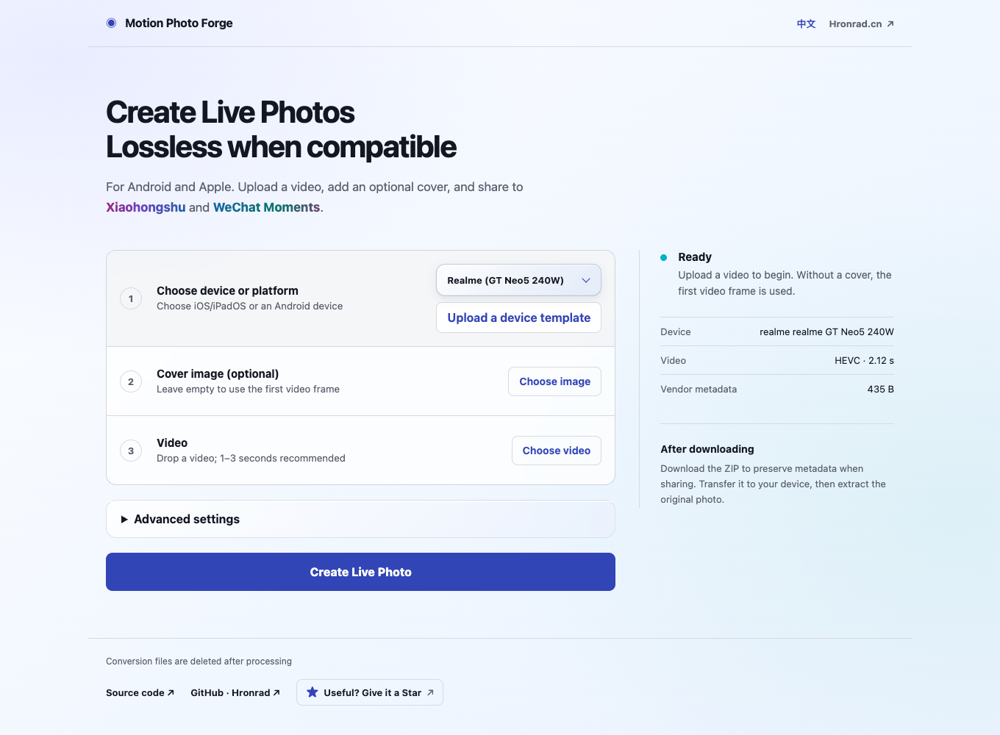

<div align="center">

# LivePhoto Forge

[](https://livephoto.hronrad.cn/en/)

[](https://livephoto.hronrad.cn/en/)
[](pyproject.toml)
[](LICENSE)
[](https://github.com/Hronrad/livephoto-forge/stargazers)

**[立即在线使用 · Open the live app →](https://livephoto.hronrad.cn/en/)**

[简体中文](README.md) · [English](README.en.md)

</div>

Combine a cover image and video into a live photo losslessly, with support for Android and Apple devices. Compatible formats preserve the original video stream; device profiles that require different codecs or dimensions re-encode it.

[](https://livephoto.hronrad.cn/en/)

<details>
<summary>Mobile preview</summary>


</details>

Screenshots show the enhanced hosted app. This repository ships a simpler WebUI with the same conversion features.

## Use

1. Choose an Android device or iOS / iPadOS, upload a short video, and optionally add a cover. If omitted, the first frame is used.
2. Download the ZIP. On Android, extract it and place the original motion JPG in `DCIM/Camera/`.
3. On Apple devices (tested iOS / iPadOS workflow), find `.pvt.zip` in Files, choose **Keep Downloaded**, and wait for it to finish. Touch and hold the ZIP and choose **Uncompress**. Tap the resulting `.pvt` file, then **Save to Photos** inside it. In Photos, look for LIVE and touch and hold to play. If direct import is unavailable, use the Mac fallback and import the JPG and MOV together into Photos on Mac.

Includes selected Realme, HONOR, Google, Redmi, Samsung, OPPO and HUAWEI profiles, plus Apple Live Photo. Compatibility depends on the OS and gallery app.

## Run locally

Install **Python 3.10+, FFmpeg and ExifTool**, then run:

```bash
python start.py
```

On macOS: `brew install ffmpeg exiftool`. You can also launch `start.command`, `start.sh` or `start.bat`. The local server listens on `127.0.0.1` by default.

HDR image processing additionally needs `ultrahdr_app`. For HEIC/AVIF, install `pip install '.[heic-hdr]'` with Python 3.11+. Apple automatic HDR covers use 10-bit HEIC; the fallback encoder requires `heif-enc` with 10-bit x265 support. Android automatic first-frame covers are ordinary JPGs. Realme video re-encoding does not preserve Dolby Vision RPU.

## Development and privacy

Run tests with `python -m unittest discover -s tests -v`. Custom deployment assets can live in the Git-ignored `.deployment-webui/` directory, or a directory specified by `WECHAT_LIVE_STATIC_DIR`.

The hosted app uploads media to the server for conversion; temporary conversion files are deleted after the response completes. Run locally to process files on your own machine.

MIT licensed. Apple pairing metadata uses Yang Zhen's Apache-2.0 [video-to-live-photo](https://github.com/yangzhen-23/video-to-live-photo) implementation; see [licenses/](licenses/). Format references: [docs/research.md](docs/research.md).

## Support the author

If LivePhoto Forge helps you, a GitHub Star or a small contribution is always welcome. Your support helps cover hosting and continued development. Thank you!

<p align="center"></p>
