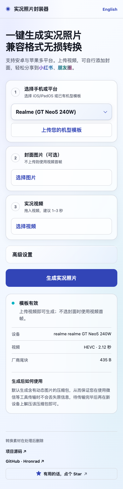

<div align="center">

# LivePhoto Forge

[](https://livephoto.hronrad.cn/)

[](https://livephoto.hronrad.cn/)
[](pyproject.toml)
[](LICENSE)
[](https://github.com/Hronrad/livephoto-forge/stargazers)

**[立即在线使用 · Open the live app →](https://livephoto.hronrad.cn/)**

[简体中文](README.md) · [English](README.en.md)

</div>

无损将封面与视频合成实况图片，支持多种平台机型（安卓/苹果）。兼容格式可保留原视频流；需要适配编码或尺寸的机型会转码。

[](https://livephoto.hronrad.cn/)

<details>
<summary>查看移动端界面</summary>



</details>

截图展示在线部署版；开源仓库提供功能完整的简洁 WebUI。

## 使用

1. 选择安卓机型或 iOS / iPadOS，上传短视频，可选自定义封面；留空时自动取首帧。
2. 下载生成的 ZIP。安卓：解压后将动态 JPG 原样放入 `DCIM/Camera/`。
3. 苹果（iOS / iPadOS 实测步骤）：在「文件」中先对 `.pvt.zip` 选择“保留下载”，等待下载完成；再长按 ZIP，选择“解压缩”；单击得到的 `.pvt` 文件，点其中的“保存到照片”。在「照片」中确认 LIVE 标志并长按播放。若直接导入不可用，可选 Mac 中转并将 JPG 与 MOV 同时导入 Mac「照片」。

支持 Realme、HONOR、Google、Redmi、Samsung、OPPO、HUAWEI 的部分机型及 Apple Live Photo。兼容性受系统与相册版本影响。

## 本机运行

安装 **Python 3.10+、FFmpeg、ExifTool**，然后运行：

```bash
python start.py
```

macOS 可用 `brew install ffmpeg exiftool`；也可双击 `start.command` / `start.sh` / `start.bat`。服务默认仅监听 `127.0.0.1`。

HDR 图片处理另需 `ultrahdr_app`；HEIC/AVIF 使用 `pip install '.[heic-hdr]'`（Python 3.11+）。Apple HDR 自动封面使用 10 位 HEIC，必要时需带 10 位 x265 支持的 `heif-enc`。安卓自动首帧封面仍为普通 JPG；realme 转码不会保留 Dolby Vision RPU。

## 开发与隐私

`python -m unittest discover -s tests -v` 运行测试。部署版静态资源可放入 `.deployment-webui/`（已被 Git 忽略），或通过 `WECHAT_LIVE_STATIC_DIR` 指定目录。

在线转换会将素材上传到服务器；转换临时文件在响应结束后删除。本机运行可在本地处理。

MIT 许可证。Apple 配对元数据使用杨振的 [video-to-live-photo](https://github.com/yangzhen-23/video-to-live-photo) Apache-2.0 实现，见 [licenses/](licenses/)。格式资料见 [docs/research.md](docs/research.md)。

## 支持作者

如果 LivePhoto Forge 对你有用，欢迎点个 Star，也可以请作者喝杯咖啡，支持服务器运行和持续开发。每一份支持都很珍贵，谢谢你！

<p align="center"></p>
